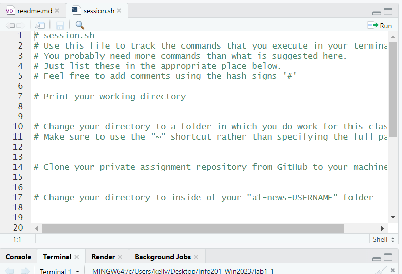

# git and markdown

The purpose of this lab is to get you prepared for PS1, hence the
tasks are comparable.  Here are the tasks:

## Basic git workflow

1. Ensure that you have a folder on your computer where you store
   info201 exercises.  If needed, create one.  Now use your shell to
   navigate to this directory, and write the command (or commands if
   you use multiple) here underneath.  Use markdown _code blocks_ to
   mark your commands.
   
   Here is an example:
   ```
   cd Desktop/school/info201/labs
   ```

1. **fork** this repository on Github under your user name (see
   [course book 4.6.1](https://faculty.washington.edu/otoomet/info201-book/git-basics.html#forking-and-cloning)).

2. **clone** the forked repo to your computer (see [course
   book 4.3.3](https://faculty.washington.edu/otoomet/info201-book/git-basics.html#git-basics-getting-creating)).
   Write the command you
   used underneath in a code block.
```  
git clone https://github.com/kle806/lab2-git-markdown.git
```

3. **add a new file** "books.md" to the repo.  You can use RStudio
   (file -> new file -> markdown file), or any other tool you find
   convenient.
   
4. add a numbered list of book you like to this file
   (see [Github markdown
   docs](https://docs.github.com/en/get-started/writing-on-github/getting-started-with-writing-and-formatting-on-github/basic-writing-and-formatting-syntax)). 
   You can use
   RStudio editor, or any other editor you like.
   
5. check **git status** (see [course book
   4.4.1](https://faculty.washington.edu/otoomet/info201-book/git-basics.html#git-basics-situational-awareness)).
   Show below, in _block quote_, what does it print.
```
   Untracked files:
  (use "git add <file>..." to include in what will be committed)
        ../books.Rmd
```
   
   Explain, in plain text, what does it mean.
   
   This means that the books file has not yet been added to the repository and any changes right now are not saved yet.
   
6. **add** the new file to the repository (see [course book
  4.4.3](https://faculty.washington.edu/otoomet/info201-book/git-basics.html#git-basics-working-adding)).
  Show your command (as a
  code block).

```  
git add books.Rmd
```

7. Was your add successful?  Check status again!  Explain what do you
   see.
   
   I see that it says my branch is up to date with the origin/main so it is saved and ready to be committed. It lists the files that are ready to be committed which is books.Rmd.
   
8. Now **commit** your changes (see [course book
   4.4.4](https://faculty.washington.edu/otoomet/info201-book/git-basics.html#git-basics-working-committing)). 
   Put your command underneath in a code block.
```   
git commit -am "Added books list"}
```

9. Was your commit successful?  How can you check it?  Show your
   command(s) as a code block and explain what you see!
```
   git status
   This says that the branch is ahead of the main since we made the change and committed it which shows that we did it successfully.
```   
   
10. Now **push** your changes to Github (see [course book 4.4.5](https://faculty.washington.edu/otoomet/info201-book/git-basics.html#git-basics-working-pushing)).  You may
   need to create access token before you are able to push.
   
11. Go to your github page.  Can you see the books.md file there with
    all the books listed?
```
yes
```

## Folders and relative path

This task is about adding images and using relative path.

1. create a folder "images" to your repo.  You can use either `mkdir`
   command, or the file manager.

2. put an image into the folder.  It should be of a type that Github
   can render, e.g. `.jpg` or `.png`, not sure about `.heic` or other
   very new formats.  (You can just download or copy it there).
   
3. check git status.  What do you see?
```
Untracked files
  books.Rmd
  images/
```

4. add image to the repo.  Show the command you are using in a code
   block.
```   
git add Screenshot_20230113_023128.png
```

5. check status again.  Does it indicate that the image has been
   added?
```
Yes, the images is no longer untracked
```

6. what is the relative path of your image if you start walking there
   from the location of your books.md file?
```
images/Screenshot_20230113_023128.png
```

   You can check if the path is correct with something like `ls
   path-to/file`, e.g.
   ```
   ls images/picture.jpg
   ```
   it lists the file name if correct, and complains about _no suc file
   or directory_ if the path is wrong.
   
7. now add the image to your books.md file using the relative path.


8. check git status and commit

9. push

10. check on github--does your books.md file now contain the image?

